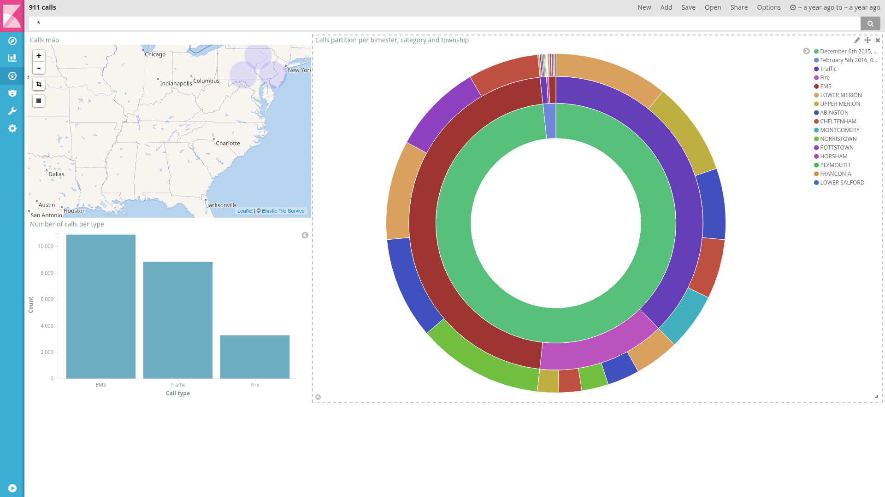
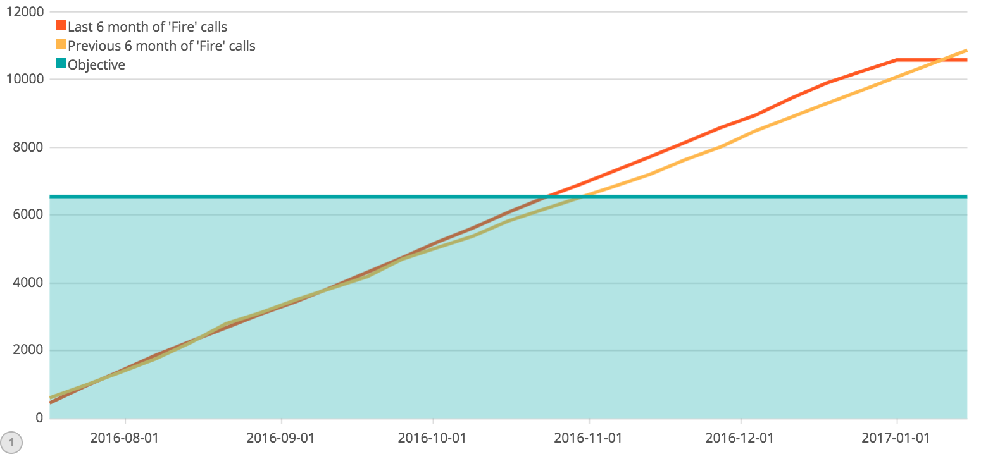

# 911 Calls avec ElasticSearch

## Import du jeu de données

Pour importer le jeu de données, complétez le script `import.js` (ici aussi, cherchez le `TODO` dans le code :wink:).

Exécutez-le ensuite :

```bash
npm install
node import.js
```

Vérifiez que les données ont été importées correctement grâce au shell (le nombre total de documents doit être `153194`) :

```
GET <nom de votre index>/_count
```

## Requêtes

À vous de jouer ! Écrivez les requêtes ElasticSearch permettant de résoudre les problèmes posés.

### Nombre d'appels autour de Lansdale

```
POST emergency/call/_search
{
  "query": {
        "bool" : {
            "must" : {
                "match_all" : {}
            },
            "filter" : {
                "geo_distance" : {
                    "distance" : "500m",
                    "coordinates" : {
                        "lat" : 40.241493,
                        "lon" : -75.283783
                    }
                }
            }
        }
    }
}
```

### Compter le nombre d'appels par catégorie

```
POST emergency/call/_search
{
  "size": 0,
  "aggs": {
    "type_count": {
      "terms": {
        "field": "type"
      }
    }
  }
}
```

### Top 3 des mois ayant comptabilisé le plus d'appels

On ne peut pas limiter le nombre de réponses de l'aggrégation dans la requête,
il faudrait donc le faire dans le code de l'application utilisant la réponse.

```
POST emergency/call/_search
{
  "size": 0,
  "aggs": {
    "calls_per_month": {
      "date_histogram": {
        "field": "timeStamp",
        "interval": "month",
        "format": "yyyy-MM",
        "order": {
          "_count": "desc"
        }
      }
    }
  }
}
```

### Top 3 des villes avec le plus d'appels pour overdose

```
POST /emergency/call/_search
{
  "size": 0,
  "aggs": {
    "withOverdose": {
      "filter": {
        "term": {
          "title": "overdose"
        }
      },
    "aggs": {
      "byTwp": {
        "terms": {
          "field": "twp",
          "size": 3,
          "order": {
            "_count": "desc"
          }
        }
      }
    }
    }
  }
}
```

## Kibana

Dans Kibana, créez un dashboard qui permet de visualiser :

* Une carte de l'ensemble des appels
* Un histogramme des appels répartis par catégories
* Un Pie chart réparti par bimestre, par catégories et par canton (township)

Pour nous permettre d'évaluer votre travail, ajoutez une capture d'écran du dashboard dans ce répertoire [images](images).



### Timelion
Timelion est un outil de visualisation des timeseries accessible via Kibana à l'aide du bouton : 

Réalisez le diagramme suivant :


Envoyer la réponse sous la forme de la requête Timelion ci-dessous:  

```
.es(index="emergency", timefield="timeStamp", q="Fire").cusum().label("Last 6 months of 'Fire' calls").color("#FF5722"), .es(index="emergency", timefield="timeStamp", q="Fire", offset=-6M).cusum().label("Previous 6 months of 'Fire' calls").color("#FFB74D"), .static(value=6000, label="Objective").color("#01A4A4").lines(fill=6)
```
